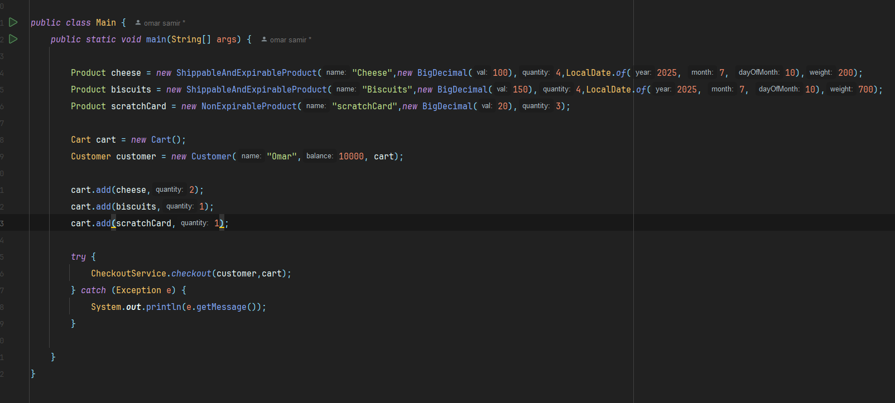
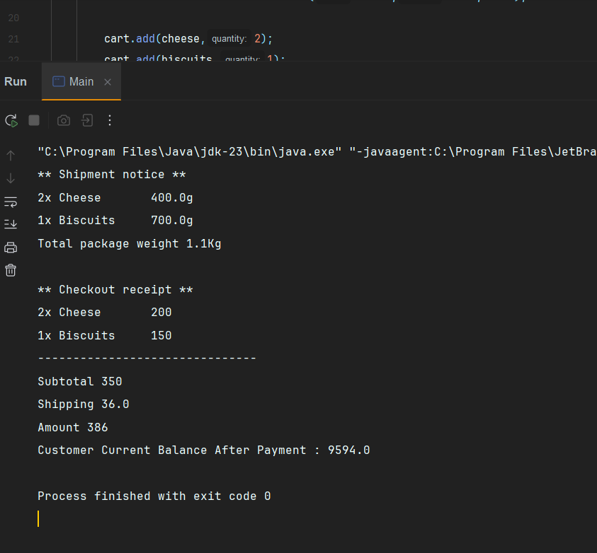

## 🧪 How to Run

1. Clone or download the project
2. Open in **IntelliJ IDEA**
3. Ensure Java SDK is installed
4. Run the `Main.java` or create your own simulation

## 📷 Screenshots From My Running  App

